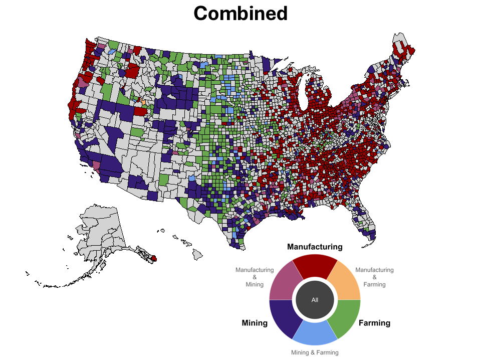

  

  

A cool figure from a recent project I have been working on.
\

## Publications

Straw, C. M., Principe, F. M., Kurtz, E. L., Wiese-Bjornstal, D. M., & Horgan, B. P. (2020). Within-field variability of turfgrass surface properties and athlete performance: Modeling their relationship using GPS and GIS technologies. Proceedings of the Institution of Mechanical Engineers, Part P: Journal of Sports Engineering and Technology, 234(2), 170-175.

Godbole, A., Kelley, E., Kurtz, E., Prałat, P., & Zhang, Y. (2017). The total acquisition number of the randomly weighted path. Discussiones Mathematicae Graph Theory, 37(4), 919-934.

## Papers Under Review

It's Time for More Time Series Clustering in Political Science Measuring County-Level Deindustrialization in the United States. (Reject and resubmit at Political Analysis)

Not in My Labor Market?: Environmental Regulation, Psychological Proximity, and Fear of Job Losses. Co-authored with Sumner, J. L. (at Social Sciences Quarterly)

Race, Ethnicity, and Moral Values: On the Measure and Mismeasure of Moral Values in the American Public. Co-authored with Goren, P. & Barrett, C. (at Political Behavior)

Not If But When: Does Survey Launch Time Affect Characteristics of Samples Obtained From Online Platforms? Co-authored with Sumner, J. L. (Reject and resubmit at Political Analysis)

## Selected Working Papers

The partyvoter Package: Simulating and Visualizing Ideological and Partisan Voting.

Nested Economies: Tracking Local Manufacturing Job Loss Trajectories Using Time Series Clustering.

## Works in Progress

The Racial Geography of Protectionist Sentiment. With Sumner, J. L.

Man Hands on Misery to Man: Family History, Opposition to Globalization, and Enduring Legacies of Deindustrialization. With Sumner, J. L.

The Words of Work: Partisan Differences in How Congress Talks About Jobs.