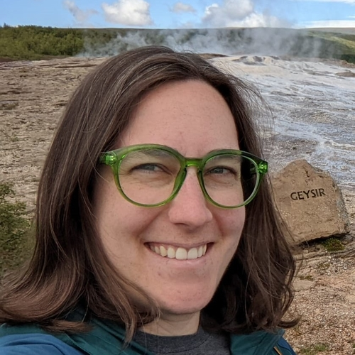

<div style= "float:right;position: relative; left: 30px; top: 0px;">
```{r echo=FALSE, out.width="300px", fig.align='right'}

 

```
</div>


<div class=text-justify>

Welcome to my website! I am a Visiting Assistant Professor of Statistics in the [Mathematics and Statistics Department](https://www.carleton.edu/math/) at Carleton College. I earned my [PhD in Political Science](https://cla.umn.edu/about/directory/profile/kurtz217) from the University of Minnesota. I also hold a Master's degree in Statistics from [UMN's School of Statistics](https://cla.umn.edu/statistics) and am an alumna of the [Population Studies training program](https://pop.umn.edu/people/emily-kurtz) with UMN's Minnesota Population Center.

My research interests are in American political economy, political methodology, data science, local politics and policy, and environmental politics. I am broadly interested in how industry death over generations influences political behavior even today. My current book project focuses on the question of why folks living in some parts of the country resist retraining in new types of jobs, such as those in green energy, even though they have the training and credentials to perform those types of jobs and their local economy could use such an economic boost. This issue has been a major focus both in electoral politics, with Democratic candidates tending to push for investments in advanced manufacturing and Republican candidates focusing on bringing back old jobs, and in the policy space, with Biden's Inflation Reduction Act investing in green energy job training in the American Heartland and Trump's tariffs motivated by the desire to have more goods built in America. In addition to this major project, I am currently studying the politics of generative AI (in particular, the sources of elites' support for it on security grounds and the sources of mass opposition on environmental and cost-of-living grounds). I also study local political responses to local environmental disasters, with a particular interest in how everyday Americans weigh potential outcomes (i.e. jobs vs. environmental safety and health) when important, local companies are the sources of environmental damage (e.g. 3M's release of PFAS into local waterways in the Twin Cities area). I have several methodological/data-driven projects; I use time-series clustering to better understand deindustrialization over time at the US county level, and I am interested in transparency and ethics in science and have written a couple of papers exploring this issue.

At Carleton, I have taught Introduction to Statistics five times (F25, W26, S26) and Introduction to Data Science (S26) once. In the 2026-2027 academic year, I will teach these classes again along with a new prep for me at Carleton: Statistical Learning. I have also been lucky enough to guide a summer research project with four brilliant Carleton students, where we explored spatial patterns in cultural and industrial institutions and made connections between these institutions are other community characteristics. You can see what we did [here (note: website in development - check back in mid-August)](https://emilylucindakurtz.github.io/CulturalInstitutionsSRP2026/).

During my time at UMN, I was a member of the Council of Graduate Students for four years and the University Senate for two years. I organized my department's American Politics Colloquium for three years and co-organized the [Political Methodology Colloquium](https://sites.google.com/umn.edu/mpmc/home?authuser=0) for a year. At Carleton, I am a Stats and Data Science Contest co-organizer.

Before going to graduate school and joining my current department at Carleton, I was a Technical Services Analyst at Epic Systems (2015-2017). I earned my B.A. in Math and Environmental Studies at Wellesley College (2011-2015). I grew up in Northeast Ohio and often miss the finer things Cleveland has to offer - its fantastic theaters, parks, and central and eastern European food - and the grittier things it has to offer - its decommissioned steel mills and its "bad" weather and sports teams. I now live in St. Paul, and while the chicken paprikash here isn't as good as it is in Cleveland (probably because it only exists if I force myself to make it), the fantastic bike lanes, extensive community education offerings, yummy Ethiopian food, and beautiful lakes are a very fair tradeoff.

In my spare time, I like to travel. I've been to 49 states and 18 countries. I also like to play strategy games, watch Cleveland sports (Minnesota sports are also acceptable), go on walks around my local lake, and eat good food. I am a fan of fall, gardening, biking, and public transit.


